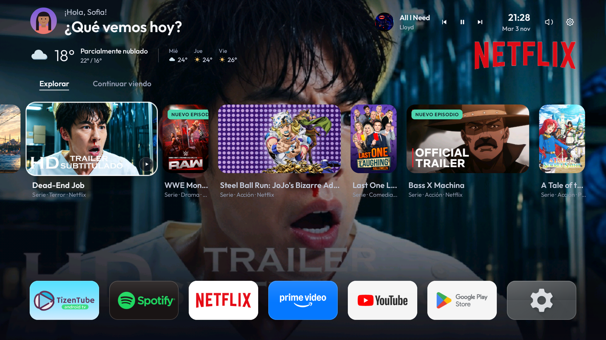

# HorizonX

Mejoras de rendimiento e interfaz para televisores. / Performance and interface improvements for televisions.

[Español](#español) · [English](#english) · [APK Android 3.9.1](dist/HorizonX-3.9.1.apk) · [Instalador PC / PC installer](dist/HorizonX-PC-3.9.1.zip)



## Español

### Qué incluye

Inicio con aplicaciones instaladas, fondos que siguen la selección, tarjetas animadas, Biblioteca, reloj, clima, reproducción de música y controles de volumen. Algunas funciones dependen de los permisos, las aplicaciones y las APIs del televisor. El diseño Android existente se conserva.

HorizonX no instala otro firmware. Mantiene Android y los servicios originales: HDMI, sonido, redes, tienda y funciones del fabricante. Instalar una aplicación y convertirla en el inicio principal son pasos distintos. En plataformas restringidas no se promete sustituir Home.

### Compatibilidad y versiones antiguas

Revisión del código: **1 de noviembre de 2026**. No se conectó ningún televisor para esta revisión.

| Sistema | Versiones contempladas por el código | Instalación | Encender / Home | Comprobación disponible |
|---|---|---|---|---|
| Android TV / Google TV | Android **6, 7, 7.1, 8, 8.1, 9, 10, 11, 12, 12L, 13, 14, 15 y 16**; API 23–36 | APK Android | Selector de inicio; ADB cuando el firmware lo permite. Android 6/7 usa selección manual | Compilación y revisión de APIs con mínimo 23; Philips TA7 con Android 14 probado anteriormente |
| Amazon Fire OS | **6, 7, 8**; nuevas familias 14/16 según API Android instalada | APK Fire específica | Arranque y redirección de Home con accesibilidad; dependen del firmware. Activación separada y reversible | Compilación y simulaciones; sin TV Fire física |
| LG webOS | **3.x, 4.x, 5.x, 6.x, 22, 23, 24, 25, 26** | IPK LG | Integración avanzada experimental solo con root ya disponible y APIs comprobadas; instalar por Developer Mode no sustituye Home | Paquete y pruebas de navegador; prueba previa de interfaz en simulador oficial LG; Home físico pendiente |
| Samsung Tizen | **2.3, 2.4, 3.0, 4.0, 5.0, 5.5, 6.0, 6.5, 7.0, 8.0, 9.0, 10.0** | WGT firmado con certificados del propietario | Vigilante limitado; la alternativa nativa exige root existente y comprobaciones. No equivale a sustitución universal de Home | Paquete, sintaxis ES5, navegador y simulaciones; sin TV Samsung física |
| Roku OS | **9.1 o posterior** como canal; modelos antiguos identificados en el catálogo | ZIP de desarrollo, canal + salvapantallas | **No sustituye Home**. Apertura de otros canales desde PC mediante ECP, cuando se permite | Compilación BrightScript y emulación; sin Roku físico |
| Hisense VIDAA | Motores Chromium 53 o posteriores, incluidos equipos documentados de 2016–2017 | Aplicación web por URL; depende del firmware | **No sustituye Home**. Puede necesitar un servidor para alojar la aplicación | Pruebas web e instalador simulado; hardware pendiente |

Las versiones son objetivos de compatibilidad del código, no una certificación de todos los modelos. Comprueba el **sistema instalado**, no solamente la marca o el año. Un Hisense puede tener VIDAA, Android, Google TV, Fire OS o Roku; cada uno usa su paquete correspondiente.

Fuera del mínimo: Android 5.x/API 22 e inferiores y Fire OS 5; LG NetCast y webOS 1/2; Samsung Orsay anterior a Tizen; Roku con firmware 3.1. Vega OS de Amazon no ejecuta APK Android y no tiene una edición instalable verificada aquí.

En Android 6/7 se incluyen bibliotecas de fechas compatibles y fuentes estáticas. En equipos que Android identifica con poca RAM se reduce la caché de imágenes; no se cambian las animaciones ni el diseño. Los proveedores de contenido introducidos en Android 8 y el puente de volumen/perfil que exige Android 8 no se fuerzan en sistemas anteriores. Las funciones que requieran esas APIs quedan limitadas; la navegación y las aplicaciones conservan sus rutas disponibles. TLS, certificados, DRM y servicios externos de equipos antiguos también dependen del fabricante.

### Catálogo de televisores

[Catálogo completo por modelo, generación y fuente oficial](companion/profiles/device-support.json). Incluye grupos de modelos Samsung, modelos Roku antiguos, familias Fire y generaciones de LG/Android. Sus registros distinguen **documentado**, **candidato** y **prueba física anterior**; no son listas de aplicaciones que se deban borrar.

Ejemplos de equipos antiguos reconocidos:

| Familia / modelo | Sistema o límite documentado | HorizonX |
|---|---|---|
| Philips Google TV TA7 / 50PUD7908/43 | Android 14, API 34 | Prueba física anterior; conserva el diseño Android actual |
| LG OLED55B6P / OLED65B6P (2016), UJ6300 (2017) | webOS 3.0 / 3.5, Chromium 38 | [Especificación LG](https://www.lg.com/us/support/products/documents/B6_Series_Spec_Sheet_Updated_10112016.pdf); adaptación antigua pendiente de hardware |
| Samsung series JS/JU de 2015 | Tizen 2.3 / WebKit | Candidato WGT; no se certifica el vigilante ni Home |
| Fire TV Stick 4K de 2018, AFTMM | Fire OS 6, API 25 | Candidato a APK Fire |
| Fire TV Stick 2.ª generación, AFTT | Fire OS 5, API 22 | Fuera del mínimo de esta APK |
| Roku 2 HD/XS, 3000X/3100X | Hasta Roku OS 9.1 | Candidato como canal; nunca reemplazo de Home |
| Roku 1/SE y Stick, 2710X/3500X | Hasta Roku OS 11 | Candidato como canal; nunca reemplazo de Home |
| Roku DVP / N1000 | Hasta Roku OS 3.1 | No compatible con esta edición |

Consulta local sin encender ni conectar una TV:

```sh
cd companion
python3 -m horizonx.support android-tv --sdk 23
python3 -m horizonx.support android-tv --sdk 33
python3 -m horizonx.support lg-webos --version 3.0
python3 -m horizonx.support samsung-tizen --version 2.3
python3 -m horizonx.support roku-os --version 9.1 --model 3100X
```

### Instalar Android por USB

1. Descarga [HorizonX-3.9.1.apk](dist/HorizonX-3.9.1.apk), cópiala al USB y conecta el USB a la TV.
2. Abre un administrador de archivos en la TV. Abre **tu unidad USB** y localiza la APK. El nombre de la unidad depende de tu pendrive.
3. Si Android lo pide, autoriza a ese administrador a instalar aplicaciones desconocidas. Pulsa **Instalar**; si HorizonX ya existe, aparecerá **Actualizar**. Conserva la instalación existente para mantener sus datos.
4. Abre HorizonX desde las aplicaciones. La instalación de la APK por sí sola no garantiza que Home cambie.
5. En Android TV con selector de inicio, entra en Ajustes → Aplicaciones predeterminadas / Inicio, elige HorizonX y confirma el uso permanente. El nombre del menú cambia según la TV. Android 6/7 se configura por esta ruta manual.
6. Si Google TV impone su inicio, abre HorizonX → Ajustes → Sistema → Configura HorizonX y sigue el proceso de depuración/autorizar conexión. En los televisores que permiten ADB local, acepta **Permitir siempre** y activa el inicio. Si no está disponible, utiliza el asistente de PC.
7. Comprueba Home desde una aplicación y un encendido normal antes de dar la activación por probada.

La depuración **no es necesaria para instalar la APK por USB**. Puede ser necesaria para activar Home, el indicador de volumen avanzado o cambios del sistema. No la desactives durante una operación ADB. No se garantiza que un puerto USB compartido mantenga el mismo comportamiento al activar depuración.

### Instalar Android desde PC / ADB

1. Descarga el [paquete PC](dist/HorizonX-PC-3.9.1.zip) y extráelo. Incluye la APK y el asistente; no hace falta compilar ni clonar el proyecto.
2. Instala Python 3.10+ y [Android Platform Tools](https://developer.android.com/tools/releases/platform-tools); comprueba que `adb` esté disponible en la terminal.
3. En la TV: Ajustes → Sistema → Información. Pulsa siete veces Compilación, si todavía no eres desarrollador. En Opciones de desarrollador habilita la depuración que ofrece tu modelo.
4. TV y PC deben estar en la misma red. En depuración inalámbrica distingue el **puerto de vinculación** del **puerto de conexión**. Si la TV exige vincular, ejecuta `adb pair IP:PUERTO_DE_VINCULACION` e introduce el código que muestra la TV. No publiques ese código.
5. Ejecuta `HorizonX.cmd` en Windows o `sh HorizonX.sh` en Linux/macOS. Elige conectar y proporciona la IP y el puerto de conexión actuales; acepta la autorización en la TV. Luego elige instalar/configurar. Los pasos que cambian Home o paquetes se autorizan por separado.
6. Comprueba que Home abra HorizonX. Una instalación/actualización correcta no sustituye esta verificación.

Downloader también puede instalar la APK desde:

```text
https://raw.githubusercontent.com/2207juan/HorizonX/main/dist/HorizonX-3.9.1.apk
```

### Activación, optimización y restauración

- La selección de Home conserva Android y las aplicaciones originales. Ambilight y funciones específicas del fabricante siguen perteneciendo al sistema de la TV.
- La optimización conserva su mecanismo de análisis, autorización, respaldo y restauración. **No aplica listas de paquetes importadas ni supone que una regla sirve para todas las marcas.** Tras retirar aquellas listas, no hay recomendaciones genéricas automáticas: revisa una selección individual antes de autorizarla. Un catálogo de modelos no demuestra qué servicio es prescindible.
- No se desinstalan paquetes esenciales por reconocer una marca. Mantén los respaldos del asistente en el PC; son específicos del dispositivo.
- Para volver al inicio anterior: HorizonX → Ajustes → Sistema → Volver al inicio original. Si no puedes abrir HorizonX, usa el apartado de restauración del mismo asistente y el respaldo de esa TV. No desinstales el único inicio operativo antes de restaurar el anterior.
- Una actualización firmada con la misma identidad conserva los datos. El identificador interno estable `tv.lightos` evita crear otra instalación; la etiqueta visible es HorizonX.
- Una APK no sustituye las pantallas protegidas de Google, Samsung, LG o del fabricante. Los permisos y controles avanzados varían por firmware.

### Instalar las otras ediciones

Cada carpeta de `otras-plataformas/` contiene **otro paquete para otro sistema operativo**. No instales todas las carpetas ni una APK en LG/Samsung.

| Sistema | Archivo y asistente | Requisitos / restauración |
|---|---|---|
| Fire OS | `otras-plataformas/amazon-fireos/installer/` · `HorizonX-FireTV.cmd` o `sh HorizonX-FireTV.sh` | ADB autorizado. `home-plan` prepara respaldo/token; `home-activate` requiere ese token. `home-restore` usa el respaldo. Root nativo opcional solo si ya existe y pasa las comprobaciones |
| LG webOS | `otras-plataformas/lg-webos/installer/` · `python3 horizonx_webos.py install --device NOMBRE --ipk ARCHIVO.ipk` | LG Developer Mode y [CLI oficial LG](https://webostv.developer.lge.com/develop/tools/cli-installation), dispositivo ya vinculado con `ares-setup-device` / `ares-novacom --getkey`. Luego `launch`. Developer Mode tiene límites de sesión. Integración Home avanzada: `home-plan`, `home-activate`, `home-restore`, solo con root existente y respaldo |
| Samsung Tizen | `otras-plataformas/samsung-tizen/installer/` · `python3 horizonx_tizen.py install --tv IP` | Developer Mode, Tizen Studio/SDB y certificados Samsung del propietario. El asistente firma el WGT. `uninstall` retira la app; desactiva antes el vigilante si lo activaste. La ruta nativa avanzada conserva su propio respaldo |
| Roku | `otras-plataformas/roku-os/installer/` · `python3 horizonx_roku.py install --roku IP` | Cuenta Roku, Developer Mode e instalador de desarrollo. Solicita contraseña de forma interactiva. Solo un canal de desarrollo a la vez. `remove` lo retira; el botón Home continúa siendo Roku |
| VIDAA | `otras-plataformas/hisense-vidaa/installer/` · `python3 horizonx_vidaa.py` | El asistente muestra las rutas compatibles con el firmware. Usa `--app-url URL` para una copia alojada; el servidor local debe seguir disponible mientras la TV lo necesite. Retira la app desde las opciones que permita tu TV |

Los ayudantes avanzados no incluyen exploits ni conceden root. Si faltan APIs, firma, permisos o un método de restauración comprobable, no dan la sustitución de Home por completada. Consulta `--help` antes de usar un asistente; no ejecutes un cambio privilegiado sin revisar su plan.

### Cómo están organizados los archivos

- `README.md`: esta única guía pública, en español e inglés.
- `dist/`: APK Android y paquete PC actuales.
- `companion/`: asistente ADB interpretable y catálogos; estos scripts son necesarios para que funcione la instalación desde PC.
- `otras-plataformas/`: instaladores y paquetes propios de cada sistema. No son instalaciones duplicadas.
- `docs/media/`: capturas y vídeos.
- `licenses/`: textos de licencia de recursos independientes que siguen incluidos.
- `SHA256SUMS`: comprobaciones de integridad de los paquetes publicados.

Las carpetas del repositorio y los Markdown **no consumen RAM del televisor**: solo se instala su paquete correspondiente. Simplificar la documentación no acelera Android. No se publica el proyecto Android ni archivos de firma.

### Fuentes y recursos

Catálogo elaborado a partir de documentación oficial: [Android](https://developer.android.com/tools/releases/platforms), [LG: motores por año](https://webostv.developer.lge.com/develop/specifications/web-api-and-web-engine), [Samsung: grupos de modelos](https://developer.samsung.com/smarttv/develop/specifications/tv-model-groups.html), [Samsung: motores web](https://developer.samsung.com/smarttv/develop/specifications/web-engine-specifications.html), [Amazon: versiones Fire](https://developer.amazon.com/docs/fire-tv/fire-os-overview.html), [Roku: equipos antiguos](https://developer.roku.com/dev/docs/hardware), [VIDAA: guía técnica](https://www.vidaa.com/wp-content/uploads/2020/12/WebApp_Development_Guide_for_VIDAA.pdf).

Outfit conserva su [OFL](licenses/Outfit-OFL.txt); los recursos de audio Kenney conservan [CC0](licenses/Kenney-CC0.txt). Kotlin y las bibliotecas de compatibilidad Android conservan sus avisos en `licenses/`. Los datos de clima Open-Meteo y de catálogo TVmaze tienen sus condiciones de atribución y uso; se consultan en ejecución. Las marcas e imágenes de servicios pertenecen a sus titulares.

## English

### Installation and older TVs

The existing Android design is preserved. HorizonX changes the home interface; it does not replace the operating system or firmware.

| Platform | Code compatibility target | Actual Home support |
|---|---|---|
| Android TV / Google TV | Android **6–16**, API 23–36, including 11/12/13/14 | Home selector or firmware-dependent ADB activation. Android 6/7 uses manual Home selection. Earlier physical testing on Philips TA7 / Android 14; older versions have API/build checks, not hardware certification |
| Fire OS | Fire OS **6/7/8**; newer 14/16 families according to installed Android API | Separate Fire APK; boot/accessibility integration is firmware-dependent and not physically certified |
| LG webOS | **3.x through 26**: 3/4/5/6/22/23/24/25/26 | IPK; experimental advanced Home integration requires existing root and supported APIs. Developer Mode installation alone is not Home replacement |
| Samsung Tizen | **2.3–10.0**, documented 2015–2026 generations | Signed WGT; limited watcher. Native path requires existing root and strict probes. Universal Home replacement is not claimed |
| Roku OS | **9.1+** development channel and screensaver | **Does not replace Home**; other apps may be opened externally over ECP |
| VIDAA | Documented Chromium 53+ engines; firmware-dependent URL installation | Hosted web app; **does not replace Home** |

These are software targets, not certification of every listed television. Android below API 23, Fire OS 5/API 22, LG NetCast/webOS 1–2, Samsung Orsay and Roku OS 3.1 are outside the supported package targets. Amazon Vega OS does not run Android APKs.

The [official-source catalog](companion/profiles/device-support.json) contains model identifiers, generation/version mappings and evidence labels. Inspect the **installed OS/API**, since model years can be misleading after updates. Catalog recognition never authorizes disabling services.

### USB APK installation

1. Download the [Android APK](dist/HorizonX-3.9.1.apk), copy it to your USB drive and open the drive on the TV using a file manager.
2. Allow that file manager to install unknown apps if requested. Select **Install**, or **Update** if HorizonX is already installed. Keep the existing installation to preserve its data.
3. Open HorizonX. Select it under the TV's Default apps / Home settings if that selector is available. Older Android 6/7 uses this manual route.
4. If the OEM forces its own Home, use HorizonX → Settings → System → Set up HorizonX. Follow the debugging authorization steps. If local ADB is unavailable, use the PC assistant below.
5. Test Home from another app and a normal power-on. Installing/updating the APK alone does not prove Home activation.

USB installation itself does not need developer mode. Advanced Home/volume/system changes may require authorized debugging. Do not turn debugging off during an ADB transaction.

### PC / ADB installation

Download and extract the [PC package](dist/HorizonX-PC-3.9.1.zip); it includes the APK. Install Python 3.10+ and [Android Platform Tools](https://developer.android.com/tools/releases/platform-tools). Enable the debugging option available on your TV under Developer options; enable Developer options by pressing Build seven times under Settings → System → About, if needed.

Connect both devices to the same network. With wireless debugging, pairing and connection ports are different: use `adb pair IP:PAIRING_PORT` only if pairing is required, then supply the connection address to the assistant. Accept the TV authorization. Run `HorizonX.cmd` on Windows or `sh HorizonX.sh` on Linux/macOS; choose connect, then install/configure. Home and package changes require separate authorization.

Updates keep the stable internal package identity `tv.lightos` to retain data. The visible app name is HorizonX. To restore: Settings → System → Back to the original Home, or the matching assistant/backup if HorizonX cannot be opened. Restore the original Home before removing the only working launcher.

### Other platforms

Use **only** your OS folder under `otras-plataformas/`. The folders contain distinct OS builds, not additional components that every TV needs. Commands and file locations are in the platform installation table above; every assistant supports `--help`.

LG requires LG Developer Mode, a paired device and the official LG CLI. Samsung requires Developer Mode and the owner's signing certificates. Roku uses the development channel installer and can hold only one development channel. VIDAA installation/hosting depends on the firmware. Fire requires authorized ADB; Home activation/restoration uses an explicit plan and token. No helper supplies an exploit or silently grants root.

### Optimization, verification and resources

Analysis, individual approval, backup and restoration remain available. Imported removal lists have been removed: there are **no generic automatic package-removal recommendations** in this release. Unknown dependencies stay enabled. Review each proposed change on the actual device; matching a model is not evidence that its services are expendable.

Offline build, API checks, browser tests and emulation are distinct from hardware tests. No TV was contacted for the November 1 review. Boot, Home, protected settings, Google accounts, DRM and advanced volume behavior on other models still require their hardware. The advanced volume/profile bridge requires Android 8+ APIs; older Android uses its available fallback routes. Old TVs can also have obsolete TLS/DRM or unavailable online services.

The repository's directories and Markdown files do not consume TV RAM; only the selected installation package does. The public documentation is consolidated here; app source/build projects and signing keys are not distributed. Required resource licenses remain under `licenses/`: [Outfit OFL](licenses/Outfit-OFL.txt), [Kenney CC0](licenses/Kenney-CC0.txt) and Android library notices. Runtime TVmaze and Open-Meteo data retain their respective attribution/use terms. Service artwork and trademarks belong to their owners.
